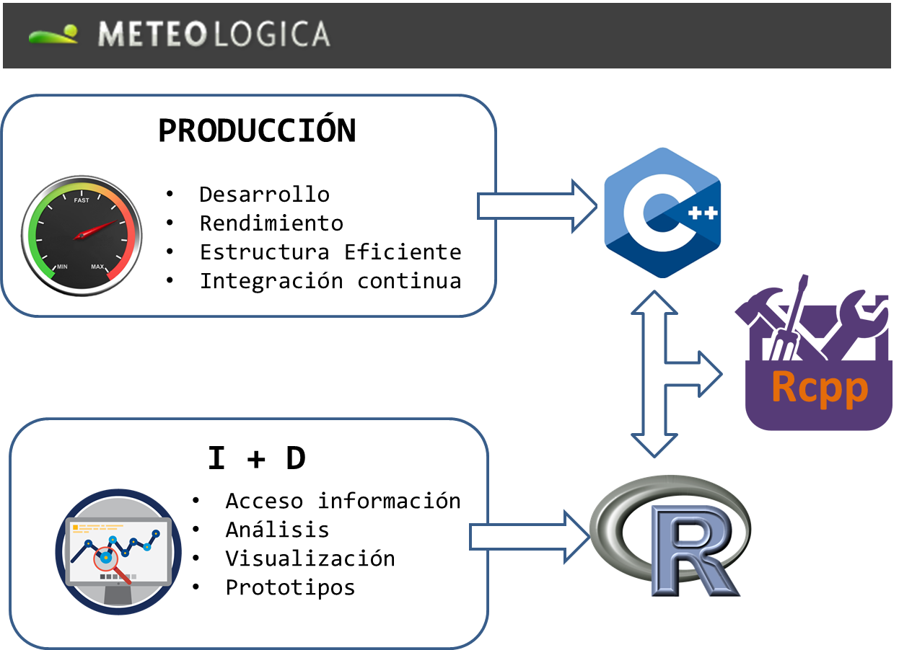

## Paquetes con Clase


### R y C++?

- Generalmente C++ como "acelerador" de funciones de R: recodificación en un lenguaje más veloz
- Lo realmente potente: Extensión de R e **integración de código externo**


## En el mundo real
<div class="centered">
 
</div>
## Interfaz al instante

### Ingredientes:

- Librería con objetos de C++ que queremos integrar
- Función en R que use los objetos anteriores como queremos.
- R, Rcpp y RStudio. <font size="3">(thx Hadley, thx Dirk)</font>
- (un poquito de C++ *programming skills*)

https://github.com/bichopaulinho/PaquetesConClase


## Nuestro caso: Regresión Múltiple usando Gradient Descent {.smaller}

- Integraremos el algoritmo de optimización **Gradient Descent** (implementación sencilla: librería [Purple](http://www.cimne.com/purple/), ligeramente adaptada a nuestro problema)
- Aplicación al problema de regresion lineal multiple
- Resultado: función contenida en un paquete (**GradDesc**)


```{r eval=FALSE}
Rcpp::Rcpp.package.skeleton(name="GradDesc",path="/tmp")
```
 
```{bash echo=FALSE}
tree GradDesc -L 1
```

## Estructura del directorio {.smaller}

```{bash, echo=FALSE}
#tree GradDesc/src -P *.cpp
tree GradDesc -I "*.o|*.so|*.Rproj|*.Rd|*.h"
```


## Funcion objetivo. Esquema

### RcppGradientDescent.cpp (Rcpp)

```{c++,eval=FALSE,}
// [[Rcpp::export]]
Rcpp::NumericVector GradientDescentSumaCuadrados(SEXP A,SEXP b) {
    ### <b>
    Purple::Vector<double> M_b = Rcpp::as<Purple::Vector<double>>(b);
    Purple::Matrix<double> M_A = Rcpp::as<Purple::Matrix<double>>(A);
    ### </b>
    //....
    return(Rcpp::wrap<Purple::Vector<double>>(minimalArgument));
}
```
- Argumentos de entrada: `SEXP A,SEXP b`. Objetos de R (Matriz y vector)
- Se transforman en objetos de la clase **Purple**: `Purple::Vector` y `Purple::Matrix`: Especializacion de la plantilla de `Rcpp::as`. Se define en **purple_wrappers.cpp**

## Funcion objetivo. Esquema (II)

### GradientDescent.cpp (Rcpp)

```{c++2,eval=FALSE,}
// [[Rcpp::export]]
Rcpp::NumericVector GradientDescentSumaCuadrados(SEXP A,SEXP b) {

    Purple::Vector<double> M_b = Rcpp::as<Purple::Vector<double>>(b);
    Purple::Matrix<double> M_A = Rcpp::as<Purple::Matrix<double>>(A);
    
    //....
    ### <b>
    return(Rcpp::wrap<Purple::Vector<double>>(minimalArgument));
    ### </b>
}
```

- Creación objeto función objetivo, algoritmo de optimización, parámetros, ejecución, etc. 
- Salida: parámetros optimizados (objeto R) mediante especialización a medida de `Rcpp::wrap`. Se define en **purple_wrappers.cpp**


## Compilación {.smaller}

### Fuentes de Purple incluidos en src/
- Ventaja: el paquete es "autocontenido". Es la forma habitual de distribución.
- Incluir todos los cabeceros de la clase en un directorio "include" (dentro del directorio del paquete)
- Las clases de la librería se compilan al instalar el paquete.
- Compilación del paquete con Build tools (devtools, RStudio). Utiliza fichero Makevars (Makevars.win):

```{bash, eval=FALSE}
## -*- mode: makefile; -*-

### <b>
PKG_CXXFLAGS=-I../inst/include
### </b>
## With R 3.1.0 or later, you can uncomment the following line to tell R to
## enable compilation with C++11 (where available)
CXX_STD = CXX11

```
Cómo funciona Rcpp:

`RcppGradientDescent.cpp` ([[Rcpp::export]]) -> `src/RcppExports.cpp` -> `R/RcppExports.R` (Función en R) 

```{r eval=FALSE}
devtools::install(".", args="--no-multiarch")
```


## La hora de la verdad

Estimación de coeficientes de regresión por Gradient Descent vs OLS

```{r}
library(GradDesc)
head(iris)
```
```{r}
A <- as.matrix(iris[,2:4])
y <- iris[,1]
```
## La hora de la verdad (II)

Estimación de coeficientes de regresión por Gradient Descent vs OLS

```{r}
coefs <- GradientDescentSumaCuadrados(A,y)
names(coefs) <- colnames(A)
# Usando función lm (quitamos el término independiente)
lm(data=iris[,-5], formula=Sepal.Length~.-1)$coefficients
coefs
```
## La hora de la verdad (III)

Estimación de coeficientes de regresión por Gradient Descent vs OLS

```{r}
# Con término independiente: incluimos una columna de unos en la matriz del modelo
A <- cbind(Interc=rep(1,nrow(A)), A)
coefs <- GradientDescentSumaCuadrados(A,y)
names(coefs) <- colnames(A)
lm(data=iris[,-5], formula=Sepal.Length~.)$coefficients
coefs
```


## Extra: RCPP_MODULE {.smaller}
 
- Macro `RCPP_MODULE`: permite exportar objetos directamente. Similar a `// [[Rcpp::export]]`
- Muy útil para exportar clases completas (constructores, métodos, etc)
- En **src/ModuloSumaCuadrados.cpp** definimos la clase *GradientDescentSumaCuadradosClase* 
```{c++4, eval=FALSE}
class GradientDescentSumaCuadradosClase {
    public:
        GradientDescentSumaCuadradosClase(SEXP A, SEXP y){
            //...
        }
        SEXP getMinimalArgument(){
            return Rcpp::wrap<Purple::Vector<double>>(gradient_descent.getMinimalArgument());
        }
        void setInitialArgument(SEXP vect_inicial){
            gradient_descent.setInitialArgument(Rcpp::as<Purple::Vector<double>>(vect_inicial));
        }
        //...
    private:
        Purple::GradientDescent gradient_descent;
        //...
    
};
```


## Extra: RCPP_MODULE (II) {.smaller}
- La exportamos como módulo. En **src/ModuloSumaCuadrados.cpp**:
```{c++3, eval=FALSE}
class GradientDescentSumaCuadradosClase{
    //...
};
RCPP_MODULE(ModuloSumaCuadrados){
    using namespace Rcpp;

    class_<GradientDescentSumaCuadradosClase>( "GradientDescentSumaCuadradosClase" )

    .constructor<SEXP,SEXP>()

    .method( "solve", &GradientDescentSumaCuadradosClase::getMinimalArgument )
    .method( "setGradientNormGoal", &GradientDescentSumaCuadradosClase::setGradientNormGoal )
    .method( "setEvaluationGoal", &GradientDescentSumaCuadradosClase::setEvaluationGoal )
    .method( "starting_point", &GradientDescentSumaCuadradosClase::setInitialArgument )
    ;
}
```


- Hay que añadir en `DESCRIPTION` :  `RcppModules: ModuloSumaCuadrados`
- Hay que establecer un punto de carga en un archivo **.R**: `R/GradDesc.R`:
`loadModule("ModuloSumaCuadrados",TRUE)`

## Extra: RCPP_MODULE (III) {.smaller}

`RCPP_MODULE` crea una [clase S4 de R](http://adv-r.had.co.nz/OO-essentials.html#s4).
```{r}
obj = new(GradientDescentSumaCuadradosClase,A,y)

punto_inicial_alternativo = c(1,-1,-2,1)
obj$starting_point(punto_inicial_alternativo)

coefs2 = obj$solve()
names(coefs2)<-colnames(A)
coefs2
lm(data=iris[,-5], formula=Sepal.Length~.)$coefficients
```


## Extra: Otra alternativa de Compilación {.smaller}

### Purple como librería externa
- Ventaja: obtenemos la librería externa de su ubicación original (integración continua)
- Se enlaza al compilar el paquete referenciandola en en el Makevars (`PKG_LIBS`)
```{bash, eval=FALSE}
## -*- mode: makefile; -*-
### <b>
PKG_CXXFLAGS=-I../../Purple
PKG_LIBS=-L../../lib -lPurple
### </b>
## With R 3.1.0 or later, you can uncomment the following line to tell R to
## enable compilation with C++11 (where available)
CXX_STD = CXX11
```
- Previamente hay que compilar Purple. Es **necesario?** Recomendable para evitar problemas de compatibilidad con la tool-chain que compila los paquetes en R (sobre todo en Windows)
- Con ayuda del fichero Makefile (Makefile.win): `make -f Makefile`
- Disponible en `VersionCompilacionExterna/`

## Problemas Frecuentes {.smaller}
- A veces no recompila los archivos. Usar: `devtools::clean_dll(); devtools::clean_source()`
- Borrar los archivos `R/RcppExport.R` y `src/RcppExport.cpp`
- Si usamos `roxygen2` revisar el `NAMESPACE`. Tiene que tener:

```{bash, echo=FALSE}
cat GradDesc/NAMESPACE
```

- Si tenemos algún memory leak: `R -f script_que_peta.R -d valgrind` [ref](http://kevinushey.github.io/blog/2015/04/05/debugging-with-valgrind/)
- Si queremos debbugear con `gdb`: `R --debugger=gdb` [ref](http://r-pkgs.had.co.nz/src.html#src-debugging)
- Pedir socorro: Stackoverflow, lista Rcpp-devel, lista **R-es**.

## Referencias
- Viñetas de Rcpp: modules, attributes, extending: `browseVignettes("Rcpp")`
- R packages de Hadley Wickham ([link a capítulo sobre código compilado](http://r-pkgs.had.co.nz/src.html))
- [Librerías de R que usan C++ con Rcpp](http://dirk.eddelbuettel.com/code/rcpp.cranusers.html): destacadas: [`RStan`](https://github.com/stan-dev/stan), Hadley: `dplyr`, `tidyr`, `readr`, `RcppArmadillo`

Otras presentaciones:

- [Presentación interesante](http://es.slideshare.net/ajayohri/rcpp-51899116)
- [Presentación François](http://www.slideshare.net/romainfrancois/rcpp-seemless-r-and-c-5381368)

## MUCHAS GRACIAS!

<div id="footer">
<a rel="license" href="http://creativecommons.org/licenses/by-sa/4.0/"></a><br /><span xmlns:dct="http://purl.org/dc/terms/" property="dct:title">Paquetes Con C++lase</span> by <a xmlns:cc="http://creativecommons.org/ns#" href="https://github.com/bichopaulinho/PaquetesConClase" property="cc:attributionName" rel="cc:attributionURL">Gonzalo Mateo & Paulino Tardáguila</a> is licensed under a<br> <a rel="license" href="http://creativecommons.org/licenses/by-sa/4.0/">Creative Commons Reconocimiento-CompartirIgual 4.0 Internacional License</a>.<br />Creado a partir de la obra en <a xmlns:dct="http://purl.org/dc/terms/" href="https://github.com/bichopaulinho/PaquetesConClase" rel="dct:source">https://github.com/bichopaulinho/PaquetesConClase</a>.
</div>
